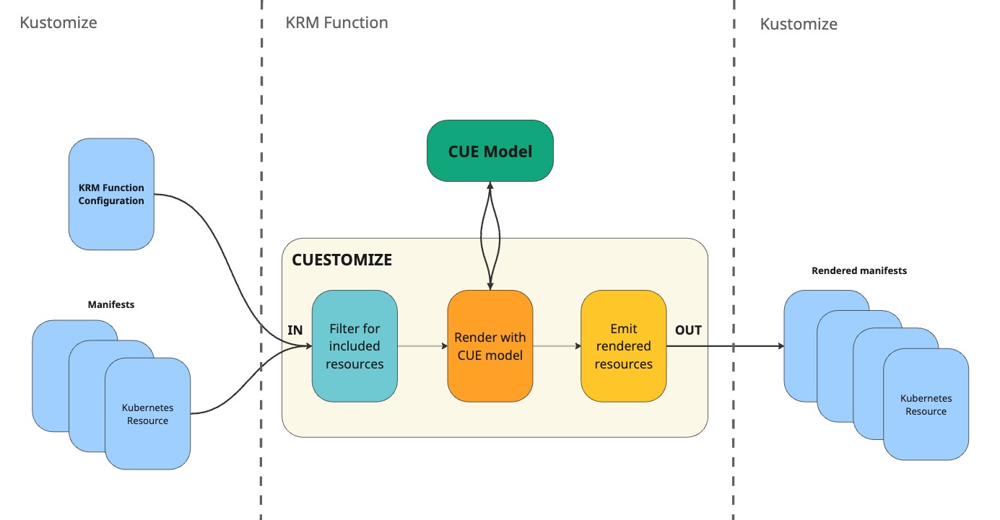
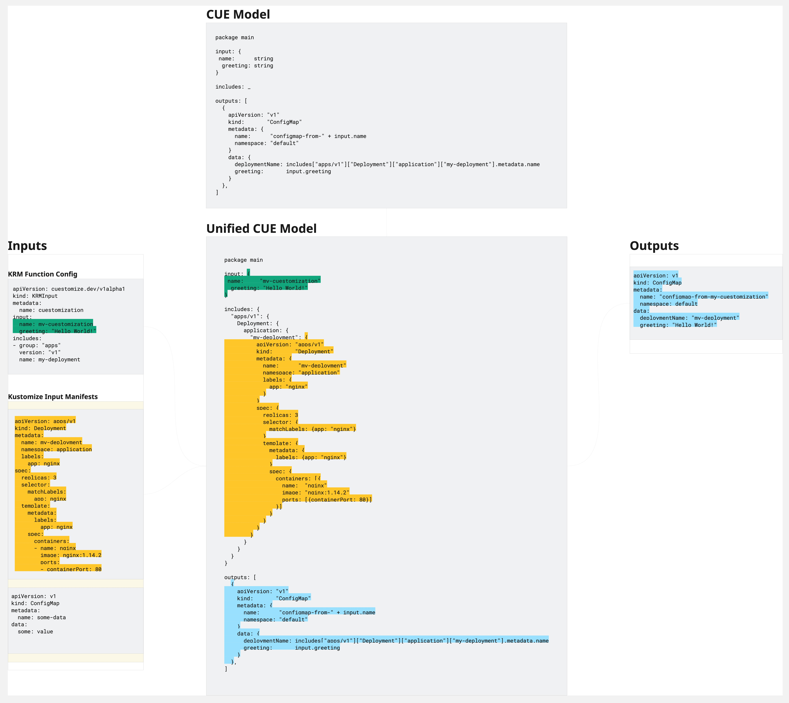

# Cuestomize Introduction
**Cuestomize** is a *Kubernetes Package Manager* using *CUE-lang* and integrated in *Kustomize*.

It is implemented as a Kustomize *KRM function* that reads a CUE model, and optionally some input resources from the Kustomize stream, generates some manifests, and passes them back to the Kustomize stream.

It provides the type-safety of CUE and the flexibility of kustomize, combined in a single tool.

Moreover, it allows your CUE model to consume resources from the Kustomize stream, which can be used to feed the CUE model with additonal contextual data. 
This means with Cuestomize you have two ways to pass input data to your CUE model:
- the `input` section of the KRM function's specification (similar to Helm values)
- resources from the Kustomize stream.

The CUE model can then use the input values and resources to generate the output manifests.

The CUE model can either be pulled from an OCI registry, or be local to the KRM function (in which case you need to build and image that bundles both the CUE model and the Cuestomize binary).

## Features
- **Type-safety**: CUE is a strongly typed language, so you are guaranteed that the generated resources are valid from a schema point of view.
- **Flexibility**: Kustomize is a very flexible tool, and Cuestomize lets you leverage that flexibility by being integrated in Kustomize, while still having the benefits of CUE.
- **Modularity**: CUE models can be composed together, so you can build complex models by combining simpler ones.
- **OCI support**: CUE models can be pulled from OCI registries, making it easy to share and reuse them.
- **Validation**: Cuestomize, leveraging CUE, gives you the power to validate your manifest generation process from end to end. You can validate both the input data and the generated resources against their respective schemas. With Cuestomize, you won't suffer from YAML indentation issues or misspelled fields anymore. If an unexpected field is found, or a required field is missing, CUE will raise an error during the evaluation of the model, preventing the generation of invalid manifests.

## How it Works
Cuestomize is implemented as a Kustomize KRM function. It reads its configuration (and optionally other manifests) from the Kustomize input stream, unifies them with a CUE model of your choice, collects the model's outputs, and passes them back to Kustomize.

<figure>
  
  <figcaption><i>Figure 1. Cuestomize Data Flow.</i></figcaption>
</figure>

### Visual Example Representation
A practical example of how data are passed and manifests generated is shown below.

Say that you have a CUE model that generates a ConfigMap with data taken from the input values, and a Deployment and a Service that are expected to be present in the Kustomize input stream.

<figure>
  
  <figcaption><i>Figure 2. Cuestomize example of how data are passed and manifests generated.</i></figcaption>
</figure>

#### Input Stream
On the left side of *Figure 2*, you can see the Kustomize input stream, which contains:
- the Cuestomize KRM function configuration, which specifies the CUE model to use, the input values to pass to the model, and which resources from the stream to forward to the model
- the other manifests from the Kustomize input stream.

#### CUE Model Unification
In *Figure 2*, on the center-top, you can see the CUE model that the function will use to generate the manifests.

In the center, you can see how the unified CUE model – i.e. the resulting CUE configuration after inputs and includes are forwarded to the model – would look like:
- the `input` field contains the input values forwarded from the function configuration
- the `includes` field contains the resources forwarded from the Kustomize input stream, in a map for ease of access
- the `outputs` field contains the *generated resources*, the ConfigMap in this case, which will be collected and passed back to Kustomize by Cuestomize.

#### Output Stream
On the right side of *Figure 2*, you can see the manifests that are collected by the function, only the ConfigMap in this case. The outputs manifests are then passed back to Kustomize, which can further process them.
